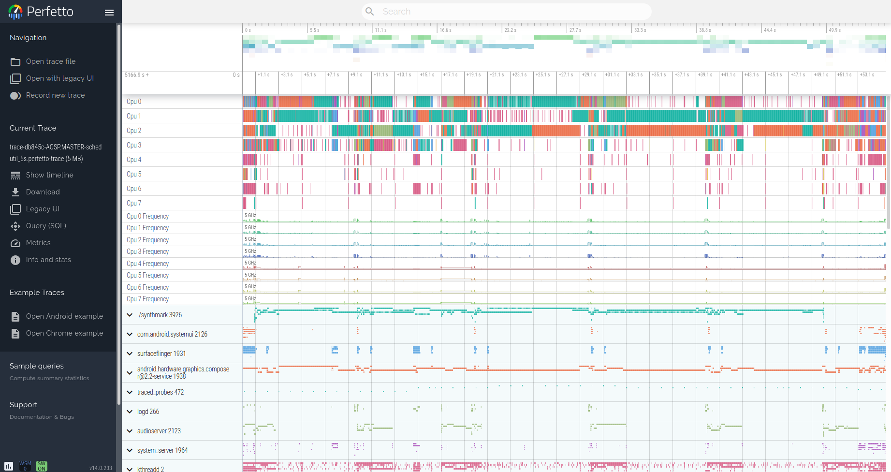

# synthmark_test 

- board: db845c
- synthmark version: 1.22
- kernel version: 5.11 mainline
- core affinity: not available

## Scripts

### Scripts to change governor and CPU idle states
All commands require root privilege
- ```sh schedutil_with_idle.sh``` set schedutil as governor and enable all idle states
- ```sh schedutil_without_idle.sh``` set schedutil as governor and disable the deepest idle state (state3)
- ```sh performance_with_idle.sh``` set performance as governor and enable all idle states except the deepest (state3)
- ```sh performance_without_idle.sh``` set performance as governor and disable all idle states except state0
- ```sh powersave.sh``` set powersave as governor and enable all idle states

### Script to run synthmark benchmark
Command requires root privilege and previous scripts to change governor (At the end of the test, the governor is set in powersave)
```command
sh synthmark_bench.sh [ performance_with_idle|performance_without_idle|schedutil_with_idle|schedutil_without_idle ] [ iteration ] [ -N(value) optional ] [ -m(l|r|s) optional] 
```
Example:
```command
sh synthmark_bench.sh performance_with_idle 5 -N100 -ms
```
## Trace
Tracing what happens during specific synthmark tests in terms of scheduling, cpu_idles and cpu_frequency. Traces are made by using built-in android tracing. By opening with [perfetto-ui](https://ui.perfetto.dev/#!/) the traces can be analysed.
The test checked are (in performance mode all idle states are disabled except for state0):
- [performance governor 5s](traces/trace-db845c-AOSP.MASTER-performance_5s.perfetto-trace)
- [performance governor 100s](traces/trace-db845c-AOSP.MASTER-performance_100s.perfetto-trace)
- [schedutil governor 5s](traces/trace-db845c-AOSP.MASTER-schedutil_5s.perfetto-trace)
- [schedutil governor 50s](traces/trace-db845c-AOSP.MASTER-schedutil_50s.perfetto-trace)
- [schedutil governor 5sN](traces/trace-db845c-AOSP.MASTER-schedutil_5sN.perfetto-trace)

Example

